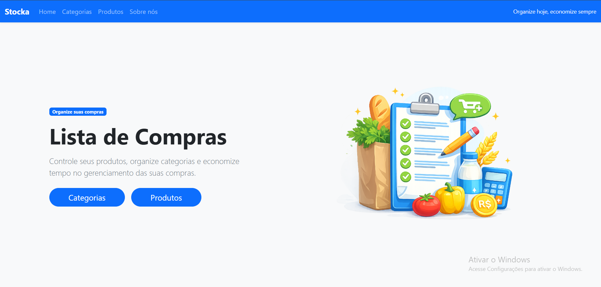
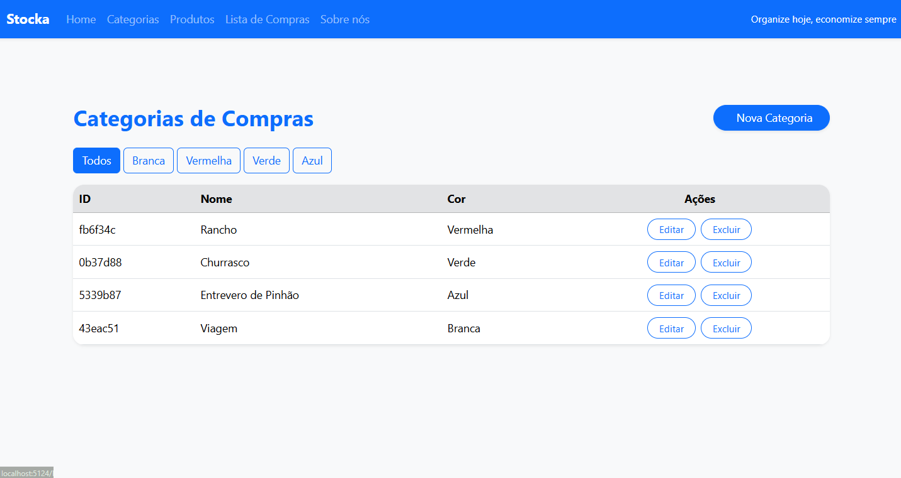
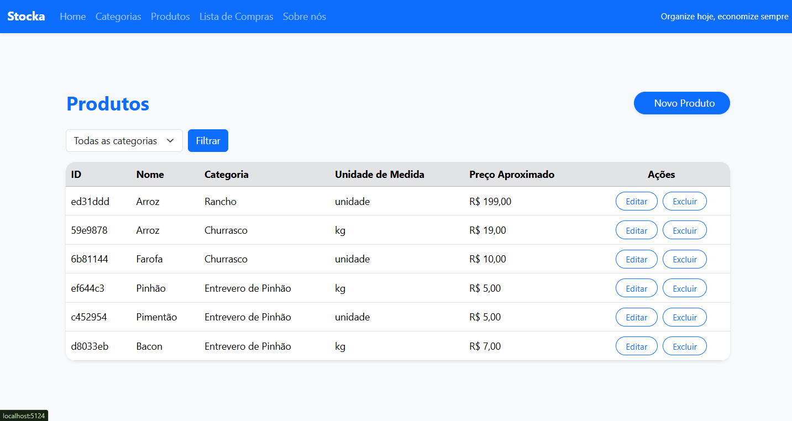
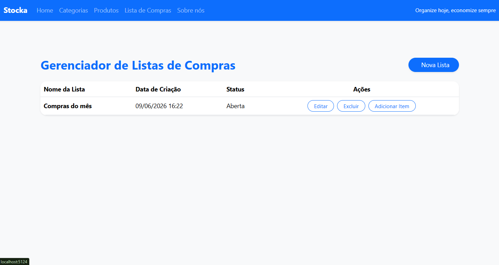
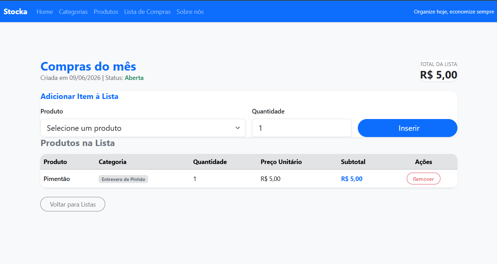

# Lista de Compras

O Lista de Compras é um sistema de gestão desenvolvido para auxiliar na organização das compras do dia a dia. A aplicação permite cadastrar categorias, produtos e listas de compras, facilitando o planejamento dos gastos e o controle dos itens necessários para cada compra.

O sistema foi desenvolvido com foco na praticidade, organização e integridade dos dados, garantindo uma experiência simples e eficiente para o usuário.

Desenvolvido por **Iago** e **Dayuã** durante o curso Fullstack da [Academia do Programador](https://www.academiadoprogramador.net) 2026.



## 1. Página Inicial

A página inicial funciona como ponto central da aplicação, oferecendo acesso rápido aos módulos do sistema e apresentando uma interface moderna e intuitiva para navegação.

## 2. Categorias



O módulo de categorias permite organizar os produtos de acordo com seu tipo, tornando as listas de compras mais estruturadas e fáceis de consultar.

### Funcionalidades

* Cadastro de novas categorias
* Edição de categorias existentes
* Exclusão de categorias sem produtos vinculados
* Visualização de todas as categorias cadastradas
* Personalização por cor para melhor identificação

## 3. Produtos



O módulo de produtos concentra todos os itens que poderão ser utilizados nas listas de compras. Cada produto é associado a uma categoria e possui informações importantes para auxiliar no planejamento das compras.

### Funcionalidades

* Cadastro de produtos
* Associação de produtos a categorias
* Registro da unidade de medida
* Registro de preço aproximado
* Edição e exclusão de produtos
* Visualização completa dos produtos cadastrados

## 4. Listas de Compras



Este módulo permite criar listas de compras para diferentes ocasiões, auxiliando no planejamento dos itens necessários e no controle dos gastos estimados.

### Funcionalidades

* Criação de listas de compras
* Controle de status da lista
* Visualização de todas as listas cadastradas
* Exibição da quantidade total de itens
* Cálculo automático do valor estimado da compra
* Edição e exclusão de listas

## 5. Itens da Lista



Os itens da lista representam os produtos adicionados a cada lista de compras, permitindo acompanhar quantidades e valores de forma organizada.

### Funcionalidades

* Adição de produtos às listas
* Controle de quantidade dos itens
* Exibição automática da categoria do produto
* Remoção de itens da lista
* Cálculo automático do valor total estimado

## Sistema

O sistema oferece operações completas de cadastro, edição, visualização e exclusão em todos os módulos, mantendo uma interface consistente e responsiva.


## ▶️ Como utilizar

1. Clone o repositório ou baixe o código fonte.
2. Abra o terminal e navegue até a pasta raiz do projeto.
3. Restaure as dependências:

```bash
dotnet restore
```

4. Execute a aplicação:

```bash
dotnet run --project ListaCompras.WebApplication
```

---

## 📦 Requisitos

* .NET 10.0 SDK
* Visual Studio 2022 ou VS Code
